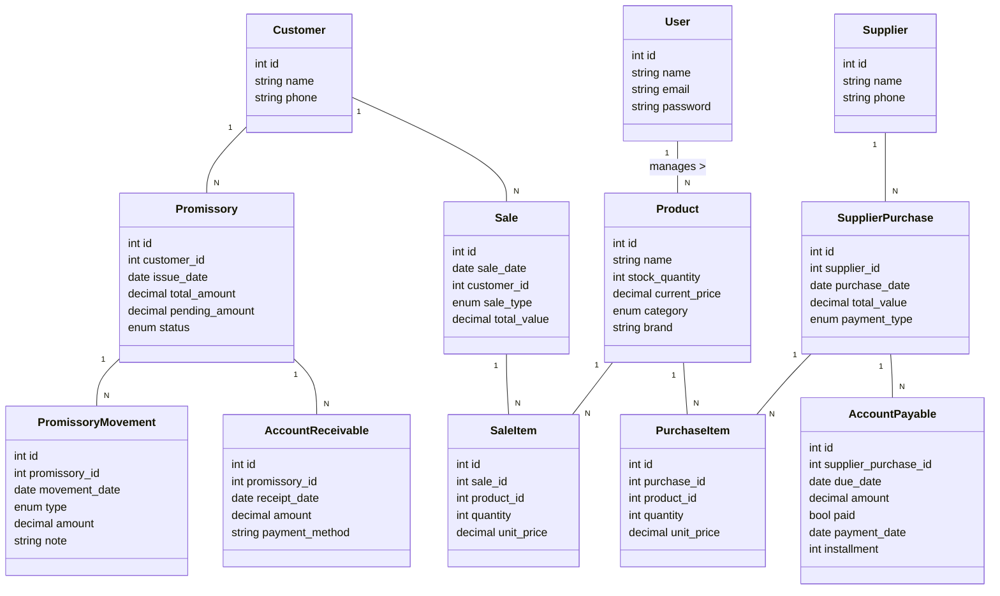

# Documento de modelo de dados para o sistema rsStore

## Diagrama de Classes e Relacionamentos

```mermaid
classDiagram

class User {
  int id
  string name
  string email
  string password
}

class Customer {
  int id
  string name
  string phone
}

class Supplier {
  int id
  string name
  string phone
}

class Product {
  int id
  string name
  int stock_quantity
  decimal current_price
  enum category
  string brand
}

class Sale {
  int id
  date sale_date
  int customer_id
  enum sale_type
  decimal total_value
}

class SaleItem {
  int id
  int sale_id
  int product_id
  int quantity
  decimal unit_price
}

class Promissory {
  int id
  int customer_id
  date issue_date
  decimal total_amount
  decimal pending_amount
  enum status
}

class PromissoryMovement {
  int id
  int promissory_id
  date movement_date
  enum type
  decimal amount
  string note
}

class SupplierPurchase {
  int id
  int supplier_id
  date purchase_date
  decimal total_value
  enum payment_type
}

class PurchaseItem {
  int id
  int purchase_id
  int product_id
  int quantity
  decimal unit_price
}

class AccountPayable {
  int id
  int supplier_purchase_id
  date due_date
  decimal amount
  bool paid
  date payment_date
  int installment
}

class AccountReceivable {
  int id
  int promissory_id
  date receipt_date
  decimal amount
  string payment_method
}

User "1" -- "N" Product : manages >
Customer "1" -- "N" Promissory
Promissory "1" -- "N" PromissoryMovement
Customer "1" -- "N" Sale
Sale "1" -- "N" SaleItem
Product "1" -- "N" SaleItem
Supplier "1" -- "N" SupplierPurchase
SupplierPurchase "1" -- "N" PurchaseItem
Product "1" -- "N" PurchaseItem
SupplierPurchase "1" -- "N" AccountPayable
Promissory "1" -- "N" AccountReceivable

```
